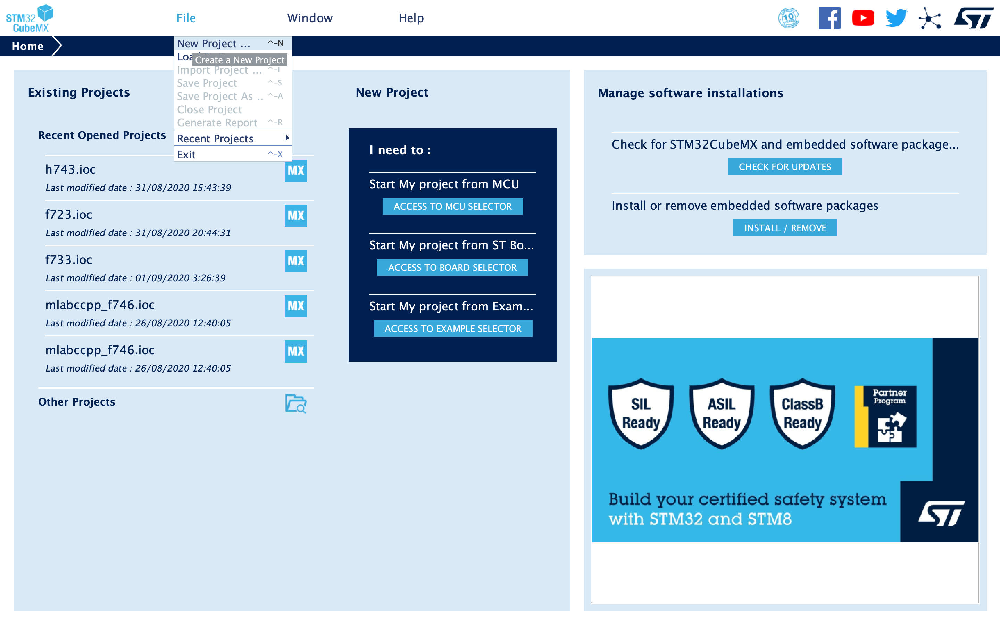
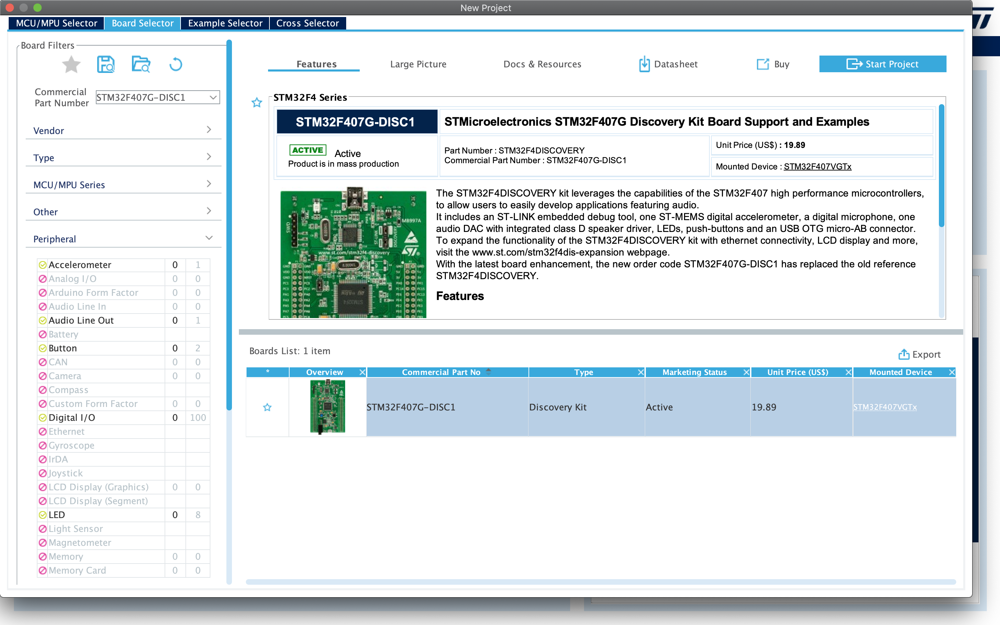
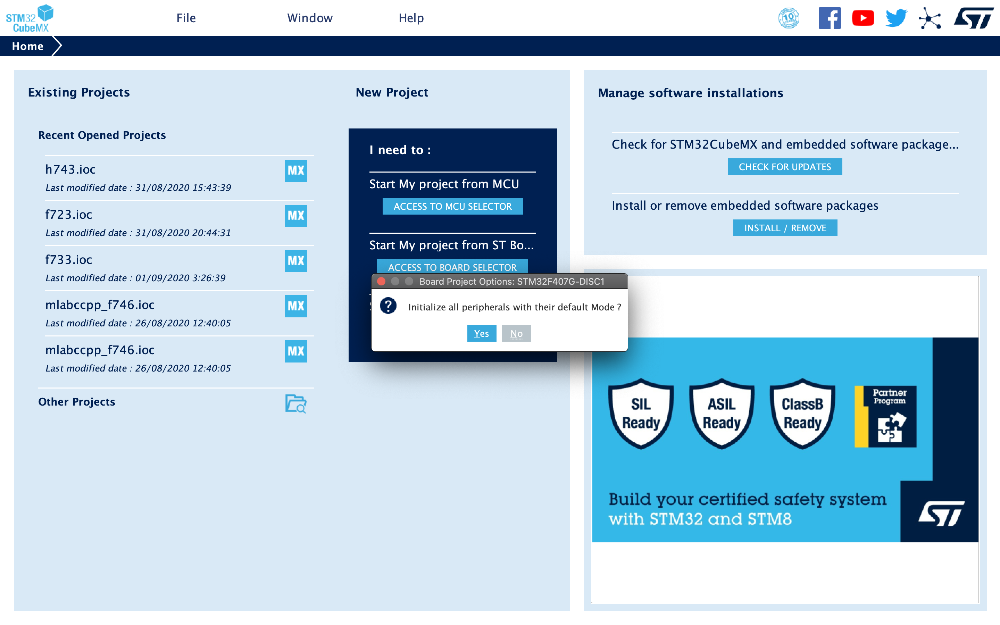
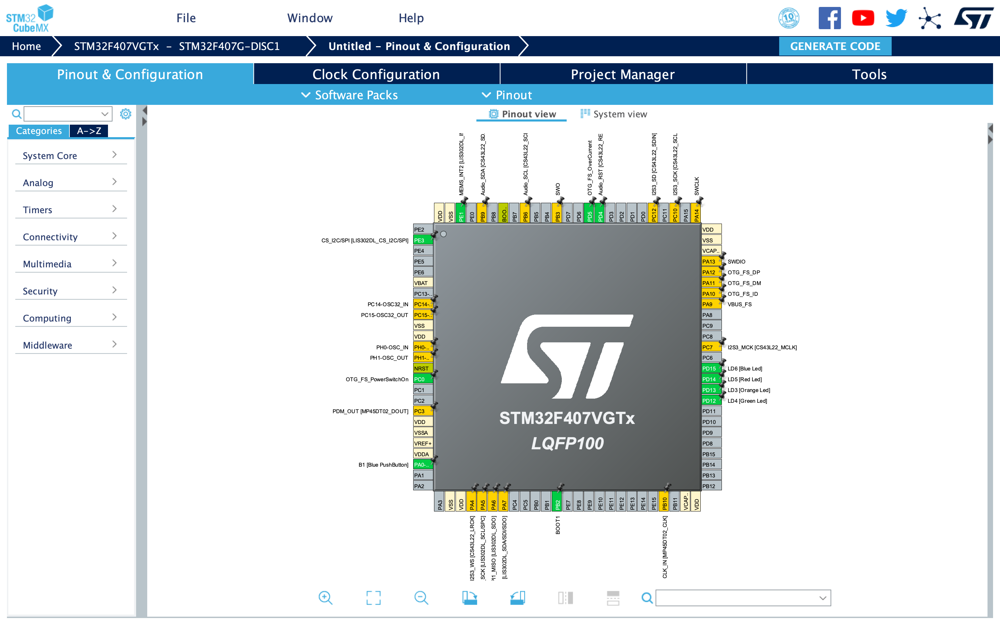
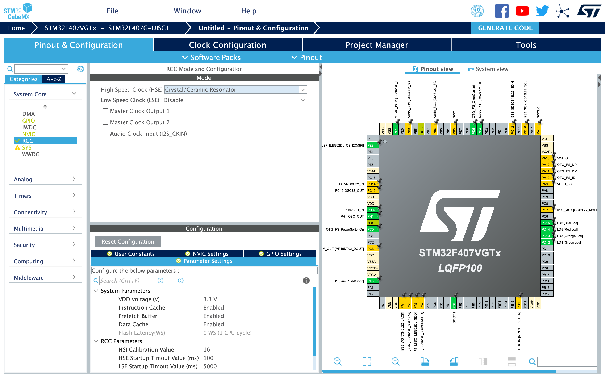
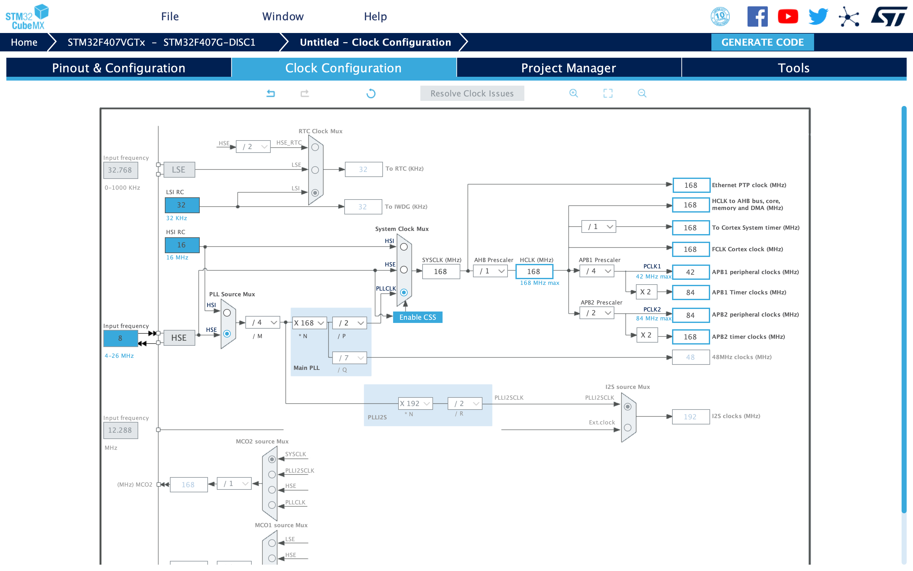
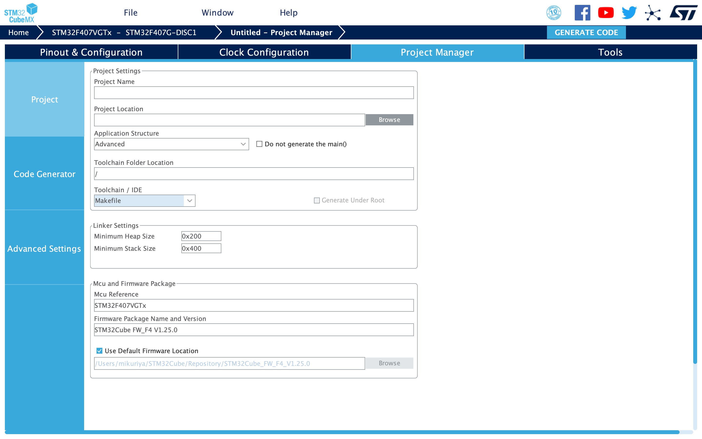
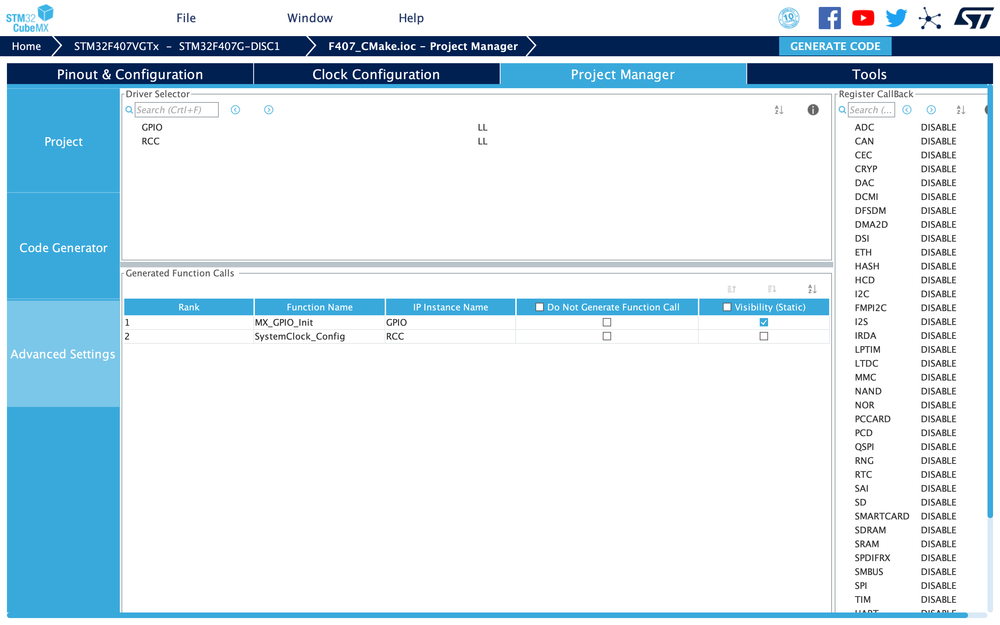
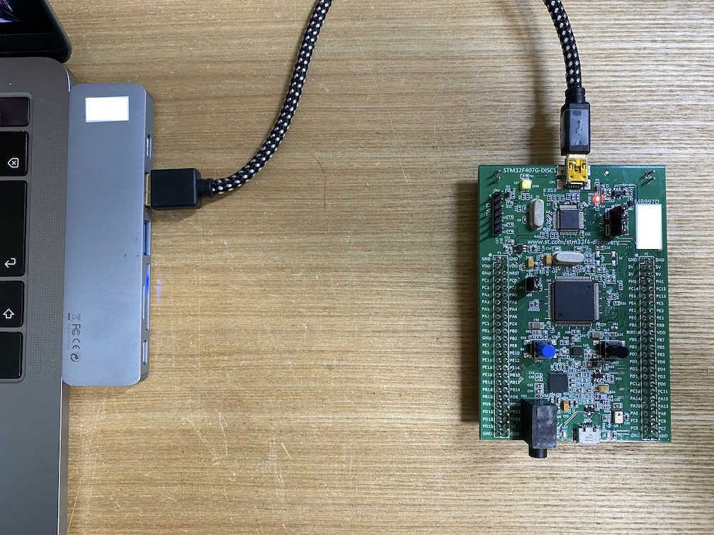
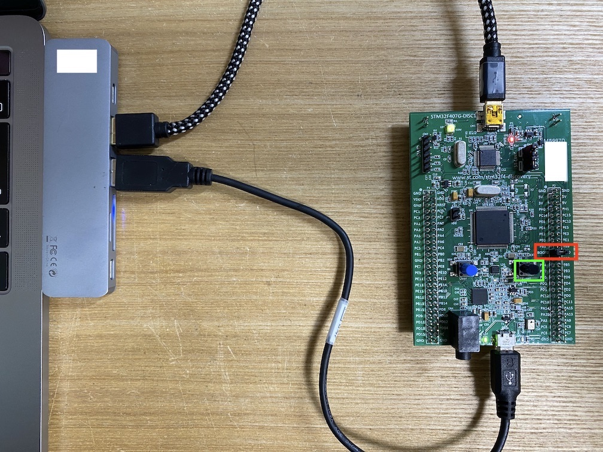

STM32 F407 Discovery CMAKE の使い方
===

STM32の開発には、STマイクロエレクトロニクス提供のライブラリを使うのが効率的とされており、現在は LL API（Low-Layer Application Programming Interface）ソフトウェアが無償提供されています。
さらに STM32CubeMX という自動生成ツールも同様に無償で使えるため、STM32CubeMX と LL を使って開発します。

使用するハードウェアは STM32F4DISCOVERY です。
秋月電子やRSコンポーネンツで 3000円程度 で購入できます。

# 解説内容

今回は CMake を使って STM32プロジェクトをビルドし、ボードに書き込む手順を解説します。
ソフトの動作内容は Lチカ とします。
解説は２部構成です。  
第一部では、CubeMX で Makefile を作ります。  
第二部では、Makefile を元に CMakeファイル を作ります。

# 用意するもの

* [STM32F4DISCOVERY](https://www.st.com/ja/evaluation-tools/stm32f4discovery.html)
* USB mini-B ケーブル
* Micro USB Micro-B ケーブル 

# 開発環境

* MacBook Pro (13-inch, 2019, Four Thunderbolt 3 ports)
* macOS Catalina バージョン 10.15.6
* [STM32CubeMX](https://www.st.com/ja/development-tools/stm32cubemx.html) Version: 6.0.0

STM32CubeMX のインストールには、STマイクロエレクトロニクスへのアカウント登録（無料）が必要です。
MacOSにインストールする手順はやや煩雑ですが、CubeMXの手順書を見ながら実施してください。

# 環境構築

## cmake

```
$ brew install cmake
$ $ cmake -version
cmake version 3.18.2
```

## arm-none-eabi-gcc

```
$ brew tap ArmMbed/homebrew-formulae
$ brew install arm-none-eabi-gcc
$ arm-none-eabi-gcc --version

arm-none-eabi-gcc (GNU Tools for Arm Embedded Processors 9-2019-q4-major) 9.2.1 20191025 (release) [ARM/arm-9-branch revision 277599]
Copyright (C) 2019 Free Software Foundation, Inc.
This is free software; see the source for copying conditions.  There is NO
warranty; not even for MERCHANTABILITY or FITNESS FOR A PARTICULAR PURPOSE.
```

## dfu-util

```
$ brew install libusb dfu-util
$ dfu-util --version
dfu-util 0.9
```

## stlink

```
$ brew install stlink
$ st-flash --version
v1.5.1
```

# 【第一部】 Makefileを使った開発手順

## コーディング前の準備

STM32CubeMX を起動すると以下の画面が開きます。
上タブの [File] → [New Project] を選択します。



マイコンの種類を選択する画面が開きます。
上バーから Board Selector を選び、 Commercial Part Number で STM32F407G-DISC1 を選択します。
画面右にボードの写真が出てくるので、画像をダブルクリックします。

 

今回は No を選択します。
（Yes を選択した方が楽なこともありますが勉強のため。）



マイコンのピンアサイン画面が開きます。
ここで一度、ファイルを保存します。（[File] → [Save Project As]）



左蘭の [System Core] → [RCC] を選択します。
High Speed Clock (HSE) を Crystal/Ceramic Resonator にします。
F4Discoveryには 8MHz のオシレーターが付いているので、これを使うための設定です。



上タブの Clock Configuration を選択します。

本マイコンは 最大168MHz で動作します。
また前述したとおり 8MHz のオシレーターが付いていますので、これを入力として逓倍と分周をして 168MHz を作り出すように設定します。

以下画像のように設定してください。



上タブの Project Maneger を選択します。

Toolchain/IDE を Makefile にします。



次に左タブの Advanced Settings を選択します。

GPIO、RCC がデフォルトだと HAL となっていますが、 本記事は LL の使い方解説なので LL を選択します。



以上が設定できたら、右上の GENERATE CORE を押してください。  
自動的にC言語のファイル等必要なものが生成されます。

以上でコーディング前の準備は完了です。

## コーディング

Core/Src/main.c を開き main関数 に以下を追記してください。

```main.c
/* Infinite loop */
/* USER CODE BEGIN WHILE */
while (1)
{
  /* USER CODE END WHILE */
  LL_mDelay(100);
  LL_GPIO_TogglePin(LD3_GPIO_Port, LD3_Pin);
  LL_GPIO_TogglePin(LD4_GPIO_Port, LD4_Pin);
  LL_GPIO_TogglePin(LD5_GPIO_Port, LD5_Pin);
  LL_GPIO_TogglePin(LD6_GPIO_Port, LD6_Pin);
  /* USER CODE BEGIN 3 */
}
```

以上でコーディングは完了です。

## 実行する

make コマンドでビルドする

```
$ make
$ ls build
F407_CMake.bin
F407_CMake.elf
F407_CMake.hex
...
```

今回使用している STM32F4DISCOVERY のファームウェア書き込み方法は２つあります。  
ボードによってはいずれか一方しか使えないものもあるので、両方解説します。
（STM32F4DISCOVERY の場合は、 ST-Link のほうが楽です）

### ST-Link

以下のようにPC と STM32F4DISCOVERY を USB Miniケーブルで繋ぎます。



以下コマンドを実行しファームウェアを書き込みます。

```
$ st-flash --format ihex write build/F407_CMake.hex

st-flash 1.6.1
2020-09-06T12:33:36 INFO common.c: F4xx: 192 KiB SRAM, 1024 KiB flash in at least 16 KiB pages.
2020-09-06T12:33:36 INFO common.c: Attempting to write 2308 (0x904) bytes to stm32 address: 134217728 (0x8000000)
EraseFlash - Sector:0x0 Size:0x4000 2020-09-06T12:33:36 INFO common.c: Flash page at addr: 0x08000000 erased
2020-09-06T12:33:36 INFO common.c: Finished erasing 1 pages of 16384 (0x4000) bytes
2020-09-06T12:33:36 INFO common.c: Starting Flash write for F2/F4/L4
2020-09-06T12:33:36 INFO flash_loader.c: Successfully loaded flash loader in sram
enabling 32-bit flash writes
size: 2308
2020-09-06T12:33:36 INFO common.c: Starting verification of write complete
2020-09-06T12:33:36 INFO common.c: Flash written and verified! jolly good!
```

### Bootloader

以下のように STM32F4DISCOVERY の BOOTO と VDD をジャンパーで結線します。  
USB mini-Bケーブル、Micro USB micro-BケーブルをPCと繋いだ状態で、基板上のリセットボタン（黒いボタン）を押します。

USB mini-Bは電源用、Micro USB micro-Bは通信用です。



以下コマンドを実行しファームウェアを書き込みます。

```
$ dfu-util -a0 -d 0x0483:0xdf11 -s 0x08000000 -D build/F407_CMake.bin
dfu-util 0.9

Copyright 2005-2009 Weston Schmidt, Harald Welte and OpenMoko Inc.
Copyright 2010-2016 Tormod Volden and Stefan Schmidt
This program is Free Software and has ABSOLUTELY NO WARRANTY
Please report bugs to http://sourceforge.net/p/dfu-util/tickets/

dfu-util: Invalid DFU suffix signature
dfu-util: A valid DFU suffix will be required in a future dfu-util release!!!
Opening DFU capable USB device...
ID 0483:df11
Run-time device DFU version 011a
Claiming USB DFU Interface...
Setting Alternate Setting #0 ...
Determining device status: state = dfuERROR, status = 10
dfuERROR, clearing status
Determining device status: state = dfuIDLE, status = 0
dfuIDLE, continuing
DFU mode device DFU version 011a
Device returned transfer size 2048
DfuSe interface name: "Internal Flash  "
Downloading to address = 0x08000000, size = 2308
Download        [=========================] 100%         2308 bytes
Download done.
File downloaded successfully
```

以上で実行完了です。

# 【第二部】 CMake を使った開発手順

## コーディング

Makefile が置いてあるディレクトリに CMakeLists.txt という名前のファイルを作ります。

```CMakeLists.txt
cmake_minimum_required(VERSION 3.6)

set(CMAKE_SYSTEM_NAME Generic)

project(F407_CMake)

# product
set(ELF_FILE ${PROJECT_NAME}.elf)
set(HEX_FILE ${PROJECT_NAME}.hex)
set(BIN_FILE ${PROJECT_NAME}.bin)
set(MAP_FILE ${PROJECT_NAME}.map)

# compiler
set(CMAKE_C_COMPILER   arm-none-eabi-gcc)
set(CMAKE_ASM_COMPILER arm-none-eabi-gcc)
set(CMAKE_CXX_COMPILER arm-none-eabi-g++)
set(CMAKE_EXE_LINKER   arm-none-eabi-g++)
set(OBJCOPY            arm-none-eabi-objcopy)
set(SIZE               arm-none-eabi-size)

# compiler options
set(CPU       cortex-m4)
set(FPU       -mfpu=fpv4-sp-d16)
set(FLOAT_ABI -mfloat-abi=hard)

add_compile_options(-mcpu=${CPU})
add_compile_options(-mthumb)
add_compile_options(${FPU})
add_compile_options(${FLOAT_ABI})
add_compile_options(-O2)
add_compile_options(-Wall)
add_compile_options(-fdata-sections)
add_compile_options(-ffunction-sections)
add_compile_options(-MMD)
add_compile_options(-MP)

set(CMAKE_C_FLAGS -std=gnu99)
set(CMAKE_CXX_STANDARD 14)
set(CMAKE_CXX_FLAGS -fno-use-cxa-atexit)

add_link_options(-mcpu=${CPU})
add_link_options(${FPU})
add_link_options(${FLOAT_ABI})
add_link_options(--specs=nosys.specs)
add_link_options(-T${CMAKE_CURRENT_SOURCE_DIR}/STM32F407VGTx_FLASH.ld)
add_link_options(-lc)
add_link_options(-lm)
add_link_options(-lnosys)
add_link_options(-Wl,-Map=${MAP_FILE},--cref)
add_link_options(-Wl,--gc-sections)

enable_language(ASM)

# define
add_definitions(-DUSE_FULL_LL_DRIVER)
add_definitions(-DPREFETCH_ENABLE=1)
add_definitions(-DINSTRUCTION_CACHE_ENABLE=1)
add_definitions(-DDATA_CACHE_ENABLE=1)
add_definitions(-DSTM32F407xx)

# includes
include_directories(
	Core/Inc
	Drivers/STM32F4xx_HAL_Driver/Inc
	Drivers/CMSIS/Device/ST/STM32F4xx/Include
	Drivers/CMSIS/Include
)

# sources
file(GLOB SRCS
	Core/Src/main.c
	Core/Src/stm32f4xx_it.c
	Drivers/STM32F4xx_HAL_Driver/Src/stm32f4xx_ll_gpio.c
	Drivers/STM32F4xx_HAL_Driver/Src/stm32f4xx_ll_rcc.c
	Drivers/STM32F4xx_HAL_Driver/Src/stm32f4xx_ll_utils.c
	Drivers/STM32F4xx_HAL_Driver/Src/stm32f4xx_ll_exti.c
	Core/Src/system_stm32f4xx.c
	startup_stm32f407xx.s
)

# executables
add_executable(${ELF_FILE} ${SRCS})

add_custom_command(TARGET ${ELF_FILE} POST_BUILD
	COMMAND ${OBJCOPY} -Obinary ${ELF_FILE} ${BIN_FILE}
	COMMAND ${OBJCOPY} -Oihex   ${ELF_FILE} ${HEX_FILE}
	COMMAND ${SIZE} --format=berkeley ${ELF_FILE} ${HEX_FILE}
	COMMENT "Invoking: Cross ARM GNU Print Size"
)
```

以上で実装は完了です。

## 実行する

```
$ mkdir out
$ cd out
$ cmake ..
$ make
$ ls

CMakeCache.txt          F407_CMake.bin          F407_CMake.hex          Makefile
CMakeFiles              F407_CMake.elf          F407_CMake.map          cmake_install.cmake
```

make したときと同様に、 binファイル と hexファイル ができていれば成功しています。あとは make と同じように STM32F4DISCOVERY に書き込んでください。

# ソースコード一式

https://github.com/hiroshi-mikuriya/f407_CMake

# 参考

* [STM32 Project with CMake](https://stackoverflow.com/questions/53819841/stm32-project-with-cmake)